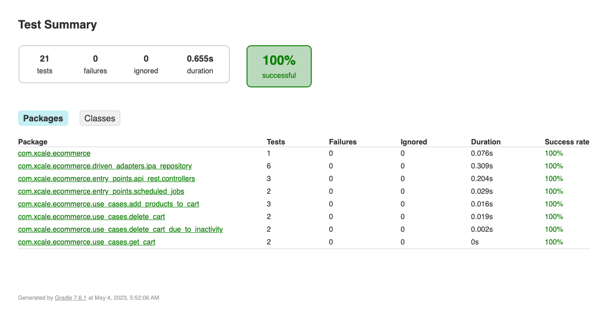
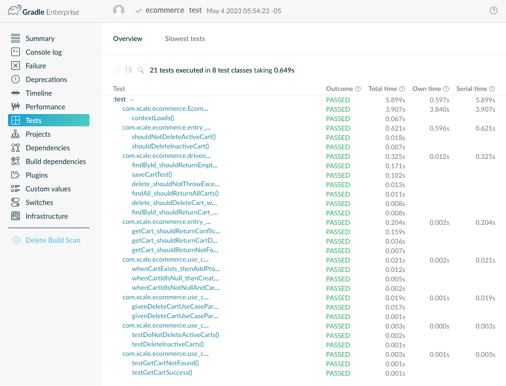
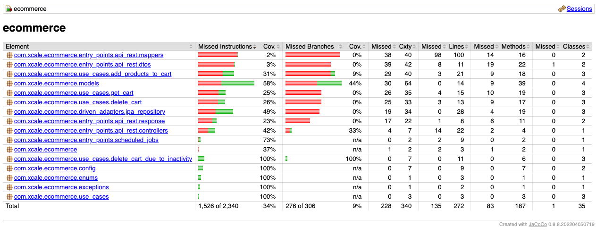
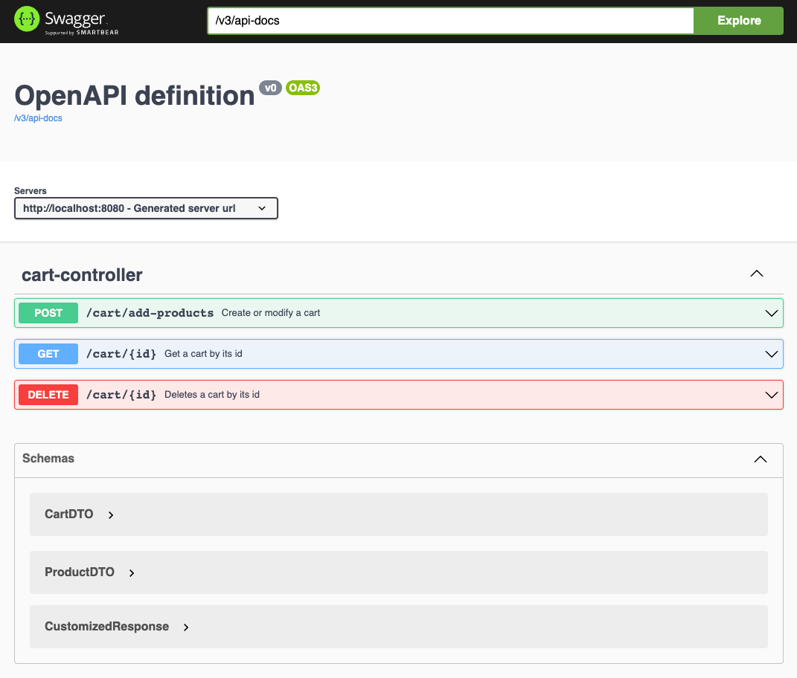

# Ecommerce App

This project was developed as part of the technical challenge for the software engineer test of the company OneBox, 
it simulates the following features:

- Creation of a shopping cart
- Addition of products to the shopping cart
- Manually deletion of the shopping cart 
- Automatically deletion of the shopping cart after 10 minutes of inactivity

## Technologies

The project makes use of the following technologies

- Spring Boot
- Spring JPA
- Lombok
- MapStruct
- H2 Database

## Requirements

- Java 11
- Gradle +7.6.1

## How to Run

- Clone the repository
- Run the command `./gradlew bootRun` in the root folder of the project

or

- Run the command `./gradlew build` in the root folder of the project
- Run the command `java -jar build/libs/ecommerce-0.0.1-SNAPSHOT.jar`

Once the application is running you should see the following messages in the console:

```
2023-05-04 05:08:45.015  INFO 40217 --- [           main] o.s.b.w.embedded.tomcat.TomcatWebServer  : Tomcat started on port(s): 8080 (http) with context path ''
2023-05-04 05:08:45.026  INFO 40217 --- [           main] c.xcale.ecommerce.EcommerceApplication   : Started EcommerceApplication in 1.646 seconds (JVM running for 1.929)
2023-05-04 05:08:45.440  INFO 40217 --- [)-192.168.31.28] o.a.c.c.C.[Tomcat].[localhost].[/]       : Initializing Spring DispatcherServlet 'dispatcherServlet'
2023-05-04 05:08:45.441  INFO 40217 --- [)-192.168.31.28] o.s.web.servlet.DispatcherServlet        : Initializing Servlet 'dispatcherServlet'
2023-05-04 05:08:45.442  INFO 40217 --- [)-192.168.31.28] o.s.web.servlet.DispatcherServlet        : Completed initialization in 1 ms
```

The application will be running on the port `8080`

## Folder Structure

This project was created using spring initializr so the basic base structure remains the same.<br>
The folders are organized in such a way that the use of a clean architecture is respected to a certain extent.

### Domain Layer

The domain layer is composed of the following packages:

- models: Contains the entities of the application and the interfaces that will be used as ports to communicate with the infrastructure layer
- use_cases: Contains the use cases of the application, each use case is a class that implements the interface `UseCase` and receives as a parameter a class that implements the interface `UseCaseParams` and returns a class that implements the interface `UseCaseResult`
- enums: Contains the enums of the application, in this case there is only one enum that represents the type of entity that can be used in the application, and is used by a use case, that is why it is in the domain layer, but it could be in another layer or in a shared package
- exceptions: Contains the exceptions thrown by the execution of the use cases 

The most important part of this layer is that it should not depend on any other layer, and it should not depend on external libraries, it should be as pure as possible. For this case we used lombok, since its only function is to reduce the boilerplate of getters, setters and constructors.

```
├── enums
|   │   └── EntityType.java
|   ├── exceptions
|   │   └── EntityNotFoundException.java
├── models
│   ├── Cart.java
│   ├── CartGateway.java
│   └── Product.java
└── use_cases
    ├── UseCase.java
    ├── UseCaseParams.java
    ├── UseCaseResult.java
    ├── add_products_to_cart
    ├── delete_cart
    ├── delete_cart_due_to_inactivity
    └── get_cart
```

### Infrastructure Layer

The infrastructure layer is composed of the following packages:

#### driven_adapters

Contains the classes that implement the interfaces of the domain layer, in this case the only interface is `CartGateway` and the only implementation is `CartGatewayImpl`, and adapter could be anything, a database, a file, a web service, etc. In this case the adapter is only a JPA repository.

```
├── driven_adapters
│   └── jpa_repository
│       ├── CartGatewayImpl.java
│       ├── CartJPA.java
│       └── CartJPARepository.java

```

#### entry_points

This package contains all the entry points of our application, everything that will generate the execution of the use cases defined in the domain layer. For this case we have 2 entry points. An api rest, which is the class that will allow the interaction with the actions of the shopping cart, and a scheduler that is in charge of the elimination of the shopping cart due to inactivity time, there can be other types of entry points, such as an MQ client, a connection by sockets, etc.
The internal structure of the packages of each entry point will depend on the needs of the entry point, as for example in our entry point [api-rest] mappers and some DTOs necessary for the implementation of the controller were created.
```
├── entry_points
│   ├── api_rest
│   │   ├── controllers
│   │   │   └── CartController.java
│   │   ├── dtos
│   │   │   ├── CartDTO.java
│   │   │   └── ProductDTO.java
│   │   ├── mappers
│   │   │   ├── UseCaseParamsMapper.java
│   │   │   └── UseCaseResultMapper.java
│   │   └── response
│   │       ├── AppResponse.java
│   │       └── CustomizedResponse.java
│   └── scheduled_jobs
│       └── DeleteCartDueToInactivityJob.java

```

### Application Layer

The application layer is composed of the following packages:

- config: Contains the configuration classes of the application, in this case we have the configuration of the dependency injection for the use cases and gateways, 
This could have been done using the @Autowired annotation of spring boot, but it would break the dependency inversion to be followed in a clean architecture.

```
├── EcommerceApplication.java
├── config
│   ├── GatewayConfiguration.java
│   └── UseCaseConfiguration.java

```

## Running Tests

Every time you run the command `./gradlew build` the tests will be executed, but if you want to run them separately you can run the command `./gradlew test`

This will generate a report in the folder `build/reports/tests/test/index.html`



Also, you can add the parameter `--scan` to the command `./gradlew test --scan` to generate a report in the cloud, this will generate a link that you can use to see the report in the browser.



This project uses jacoco to generate the test coverage report, you can run the command `./gradlew jacocoTestReport` to generate the report, this will generate a report in the folder `build/reports/jacoco/test/html/index.html`



## Examples

Here are some endpoints you can call:

### Get information about system health, configurations, etc.

```
GET http://localhost:8080/actuator
GET http://localhost:8080/actuator/health
```

### Create a shopping cart

```
POST http://localhost:8080/cart/add-products
Accept: application/json
Content-Type: application/json

{
    "products": [
        {
            "id": 1,
            "description": "Product 1",
            "amount": 10
        }
    ]
}

RESPONSE: HTTP 200 (OK)
{
    "data": {
        "products": [
            {
                "id": 1,
                "description": "Product 1",
                "amount": 10.0
            }
        ],
        "cartId": "f39cd3d5-363a-46a2-84ef-1e129a97e163"
    },
    "errorMessage": null
}
```

### Add products to an existing shopping cart

```
POST http://localhost:8080/cart/add-products
Accept: application/json
Content-Type: application/json

{
    "cartId": "f39cd3d5-363a-46a2-84ef-1e129a97e163",
    "products": [
        {
            "id": 2,
            "description": "Product 2",
            "amount": 10
        }
    ]
}

RESPONSE: HTTP 200 (OK)
{
    "data": {
        "products": [
            {
                "id": 1,
                "description": "Product 1",
                "amount": 10.0
            },
            {
                "id": 2,
                "description": "Product 2",
                "amount": 20.0
            }
        ],
        "cartId": "f39cd3d5-363a-46a2-84ef-1e129a97e163"
    },
    "errorMessage": null
}
```

### Add products to an unexisting shopping cart

```
POST http://localhost:8080/cart/add-products
Accept: application/json
Content-Type: application/json

{
    "cartId": "f39cd3d5-363a-46a2-84ef-1e129a97e162",
    "products": [
        {
            "id": 2,
            "description": "Product 2",
            "amount": 20
        }
    ]
}

RESPONSE: HTTP 404 (NOT_FOUND)
{
    "data": null,
    "errorMessage": "Entity of type 'CART' with id 'f39cd3d5-363a-46a2-84ef-1e129a97e162' not found"
}
```

### Get a shopping cart

```
GET http://localhost:8080/cart/f39cd3d5-363a-46a2-84ef-1e129a97e163

RESPONSE HTTP 200 (OK)
{
    "data": {
        "products": [
            {
                "id": 1,
                "description": "Product 1",
                "amount": 10.0
            }
        ],
        "cartId": "f39cd3d5-363a-46a2-84ef-1e129a97e163"
    },
    "errorMessage": null
}
```

### Delete a shopping cart

```
DELETE http://localhost:8080/cart/f39cd3d5-363a-46a2-84ef-1e129a97e163

RESPONSE: HTTP 200 (OK)
{
    "data": null,
    "errorMessage": null
}
```

## Playground

This project uses swagger to document the endpoints, you can access it by going to the following url:

```
http://localhost:8080/swagger-ui/index.html#/
```




